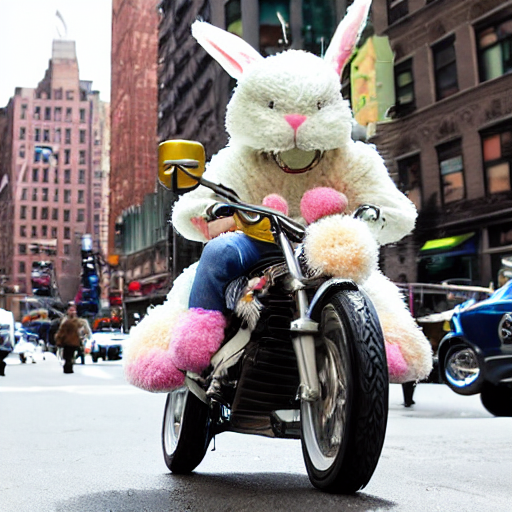
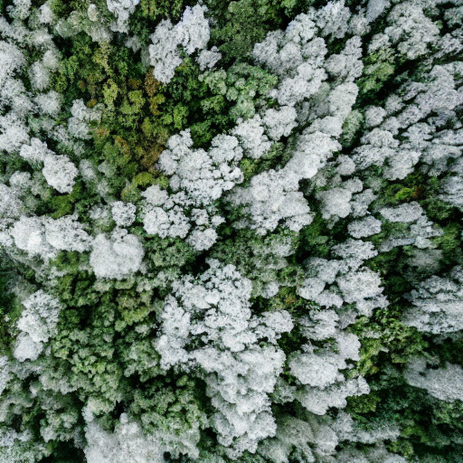
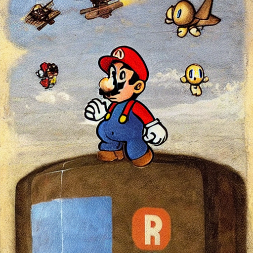
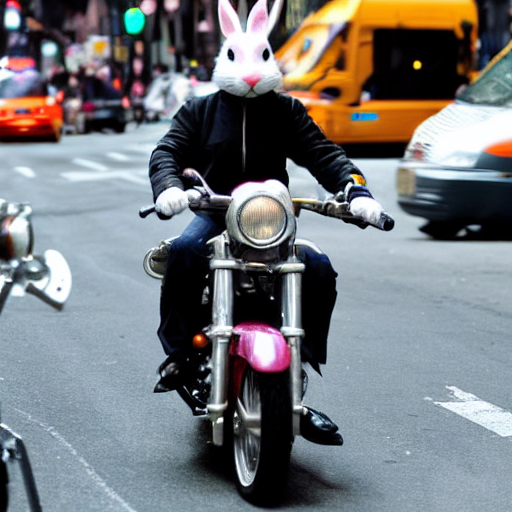
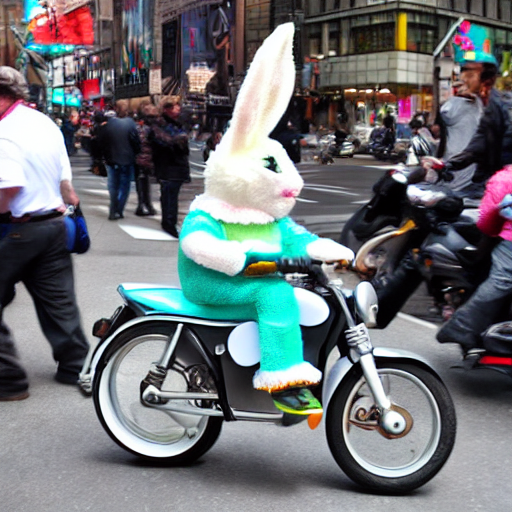
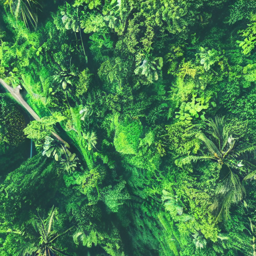
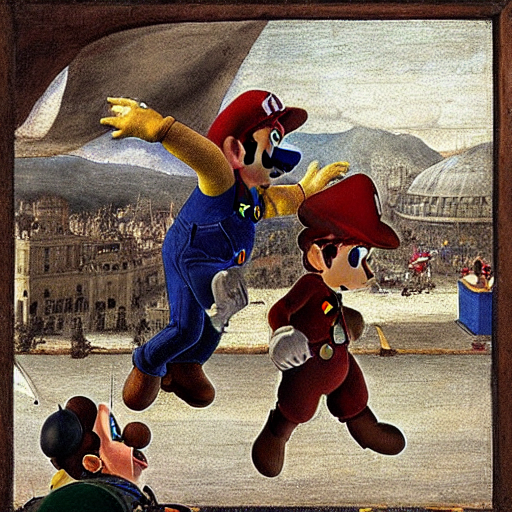
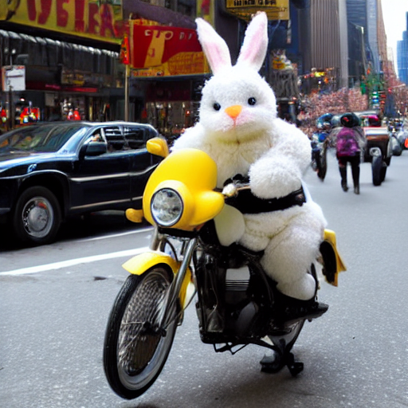
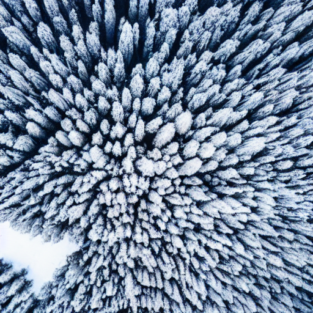
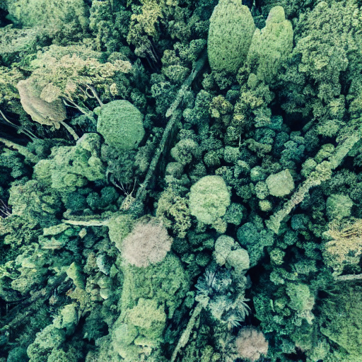

<p align="center">
  
  
</p>

<br>

# ⚡️ Real-time inference for Stable Diffusion
<!--  -->

<p align="center">
 
</p>

Stochastic provides this repository to perform fast real-time inference with `Stable Diffusion`. The goal of this repo is to collect and document as many optimization techniques for Stable Diffusion as possible. 

Currently this repository includes 4 optimization techiques with more in the pipeline. Feel free to open a PR to submit a new optimization technique to the folder.

<!-- TOC -->
Table of contents:
- [Optimizations](#-optimizations)
- [Benchmarks](#benchmarks)
  - [Setup](#setup)
  - [Online results](#online-results)
  - [Batched results](#batched-results)
  - [Sample images generated](#sample-images-generated)
- [Deploy](#deployment)
    - [Quickstart](#-quickstart)
    - [How to get less than 1s latency?](#how-to-get-less-than-1s-latency)
    - [Manual](#manual)
- [Stochastic](#-stochastic)
    - [Features](#features)
- [Reference](#reference)
<!-- /TOC -->

## 🔥 Optimizations

- AITemplate: [Latest optimization framework of Meta](https://github.com/facebookincubator/AITemplate)
- TensorRT: [NVIDIA TensorRT framework](https://github.com/NVIDIA/TensorRT)
- nvFuser: [nvFuser with Pytorch](https://pytorch.org/blog/introducing-nvfuser-a-deep-learning-compiler-for-pytorch/)
- FlashAttention: [FlashAttention intergration in Xformers](https://github.com/facebookresearch/xformers)

## Benchmarks

### Setup

For hardware, we used 1x40GB A100 GPU with CUDA 11.6 and the results are reported by averaging 50 runs.

The following arguments were used for image generation for all the benchmarks:

```javascript
{
  'max_seq_length': 64,
  'num_inference_steps': 50, 
  'image_size': (512, 512) 
}
```

### Online results
For `batch_size` 1, these are the latency results:

| project                | Latency (s) | GPU VRAM (GB) |
| :--------------------- | :---------- | :------------ |
| PyTorch           fp16 |  5.77       |  10.3         |
| nvFuser           fp16 |  3.15       |  ---          |
| FlashAttention    fp16 |  2.80       |  7.5          |
| TensorRT          fp16 |  1.68       |  8.1          |
| AITemplate        fp16 |  1.38       |  4.83         |

### Batched results

The following results were obtained by varying `batch_size` from 1 to 24.

| project           \ bs |      1        |     4         |    8          |    16             |   24              | 
| :--------------------- | :------------ | :------------ | :------------ | :---------------- | :---------------- |
| Pytorch           fp16 | 5.77s/10.3GB  | 19.2s/18.5GB  | 36s/26.7GB    |  OOM              |                   |
| FlashAttention    fp16 | 2.80s/7.5GB   |  9.1s/17GB    | 17.7s/29.5GB  |  OOM              |                   |
| TensorRT          fp16 | 1.68s/8.1GB   |  OOM          |               |                   |                   |
| AITemplate        fp16 | 1.38s/4.83GB  | 4.25s/8.5GB   | 7.4s/14.5GB   |  15.7s/25GB       |  23.4s/36GB       |

> Note: TensorRT fails to convert UNet model from ONNX to TensorRT due to memory issues.

### Sample images generated

[Click here to view the complete list of generated images](./generated_images/README.md)

| Optimization \ Prompt | Super Mario learning to fly in an airport, Painting by Leonardo Da Vinci | The Easter bunny riding a motorcycle in New York City | Drone flythrough of a tropical jungle convered in snow
| --- | --- | --- | ---
| PyTorch           fp16 |        |           |  |
| nvFuser           fp16 |       |           |  |
| FlashAttention    fp16 |        |           |  |
| TensorRT          fp16 |        |           |  |
| AITemplate        fp16 |        |           |  |
## 🚀 Quickstart

Make sure you have [Python](https://www.python.org/downloads/) and [Docker](https://docs.docker.com/engine/install/) installed on your system

1. Install the latest version of `stochasticx` library.
```
pip install stochasticx
```

2. Deploy the Stable Diffusion model
```
stochasticx stable-diffusion deploy --type aitemplate
```

If you don't have a Stochastic account, then the CLI will prompt you to quickly create one. It is free and just takes 1 minute [Sign up →](https://app.stochastic.ai/signup)

> Alternatively, you can deploy stable diffusion without our CLI by checking the steps [here](#manual-deployment).


To infer with this deployed model:
```
stochasticx stable-diffusion infer --prompt "Riding a horse"
```
 Check all the options of the `infer` command:
```
stochasticx stable-diffusion infer --help
```


You can get the logs of the deployment executing the following command:
```
stochasticx stable-diffusion logs
```

Stop and remove the deployment with this command:
```
stochasticx stable-diffusion stop
```

## How to get less than 1s latency?

Change the `num_inference_steps` to `30`. With this, you can get an image generated in 0.88 seconds. 

```javascript
{
  'max_seq_length': 64,
  'num_inference_steps': 30, 
  'image_size': (512, 512) 
}
```

You can also experiment with reducing the `image_size`.

## Manual deployment

Check the `README.md` of the following directories:
- AITemplate
- FlashAttention
- nvFuser
- PyTorch
- TensorRT 

## ✅ Stochastic

Stochastic was founded with a vision to make deep learning optimization and deployment effortless. We make it easy to ship state-of-the-art AI models with production-grade performance.

### Features
- Auto-optimization of deep learning models
- Benchmarking of models and hardware on different evaluation metrics
- Auto-scaling hosted and on-prem accelerated inference for models like BLOOM 176B, Stable Diffusion, GPT-J [Enquire →](https://stochastic.ai/contact)
- Support for AWS, GCP, Azure clouds and Kubernetes clusters

### [Sign up →](https://www.stochastic.ai/)


## Reference

- [HuggingFace Diffusers](https://github.com/huggingface/diffusers)
- [AITemplate](https://github.com/facebookincubator/AITemplate)
- [Make stable diffusion up to 100% faster with Memory Efficient Attention](https://www.photoroom.com/tech/stable-diffusion-100-percent-faster-with-memory-efficient-attention/)
- [Making stable diffusion 25% faster using TensorRT](https://www.photoroom.com/tech/stable-diffusion-25-percent-faster-and-save-seconds/)
