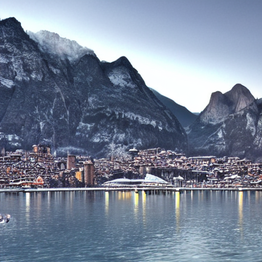
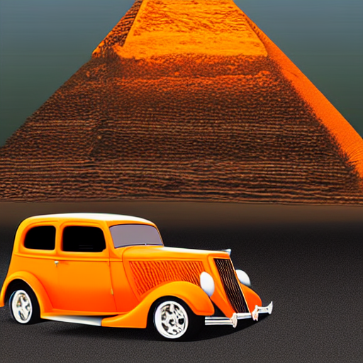
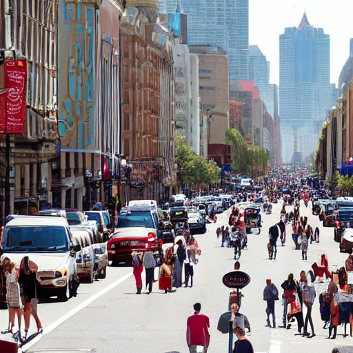
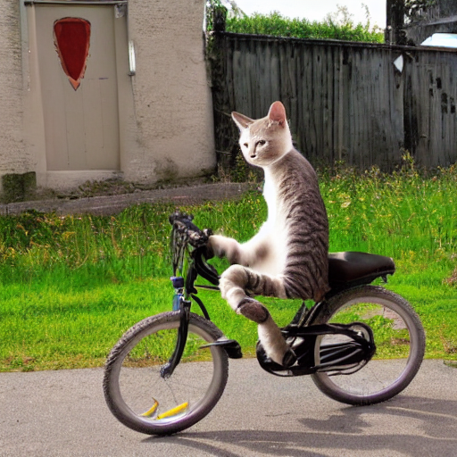
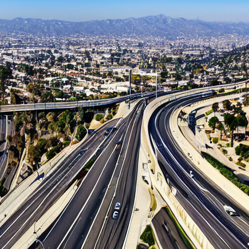
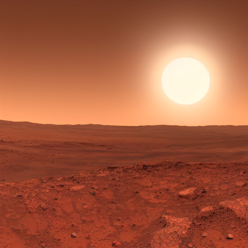
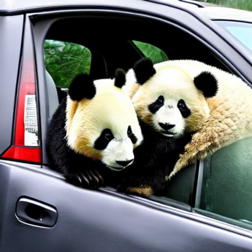

# Stable Diffusion images with NvFuser

| Prompt | Generated image |
| --- | --- 
| Super Mario learning to fly in an airport, Painting by Leonardo Da Vinci | 
| The Easter bunny riding a motorcycle in New York City | 
| Lecco in the winter in the year 2055 | 
| photorealistic orange 1935 ford in ancient Qgypt pyramid of Giza in background | 
| the boulevards are crowded today | 
| TA photo of cat riding on a bicycle | 
| Bird-eye view of a highway in Los Angeles | 
| A beauty sunrise on mars | 
| A panda bear ridding a car | 
| Drone flythrough of a tropical jungle convered in snow | 